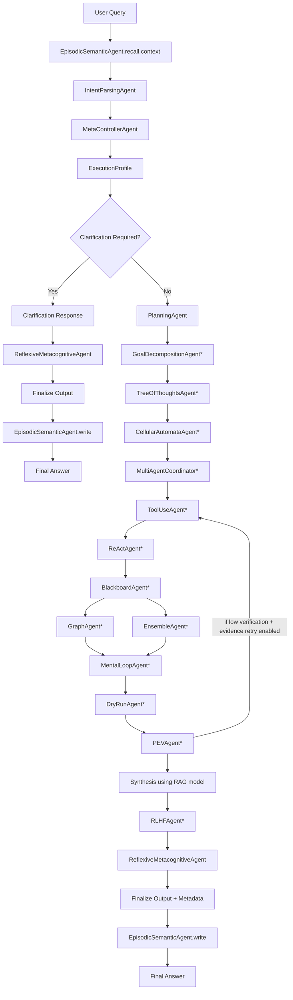

# Advanced AutoBot Architecture

This folder contains a single main implementation file: `architecture.py`.

It is an advanced, multi-agent, task-driven architecture that combines:

- Tool use
- ReAct loop
- Planning
- Multi-agent coordination
- PEV (Plan-Execute-Verify)
- Blackboard collaboration
- Episodic + semantic memory
- Tree of Thoughts
- Mental loop simulation
- Meta-controller routing
- Graph memory
- Ensemble reasoning
- Dry-run safety check
- RLHF-style self-revision
- Cellular automata prioritization
- Reflexive metacognitive confidence assessment

It uses the requested LiquidAI models by default:

- `LiquidAI/LFM2.5-1.2B-Instruct` (planning/revision)
- `LiquidAI/LFM2-1.2B-RAG` (final synthesis)
- `LiquidAI/LFM2.5-1.2B-Thinking` (reasoning/action decisions)

## Purpose

`architecture.py` is designed to be the central orchestrator for an advanced agentic AI workflow where:

- different specialist agents communicate through a shared context and message bus,
- planning and execution are separated,
- tool usage is integrated with iterative reasoning,
- safety and verification layers gate output quality,
- memory accumulates across runs,
- final output includes confidence and validation metadata.

## Adaptive Execution (Critical Behavior)

The architecture is **not a fixed mandatory pipeline** for every query.

For each task, it first builds an `execution_profile` from:

- task category (`general_qa`, `data_gathering`, `analysis`, `code_generation`, `debugging`, `workflow_automation`, `verification`, `decision_making`, `prediction_forecasting`, `learning_adaptation`, `collaboration`, `negotiation`, `tool_use`)
- estimated complexity (`simple`, `medium`, `hard`)
- depth (`low`, `medium`, `high`)

Then it selectively runs only required agents. Example:

- simple QA: minimal flow (plan + synthesize + confidence)
- medium tasks: selective reasoning + verification agents
- hard tasks: full flow, including retry loops and optional parallel branches

Parallel processing is used on hard tasks for independent analysis branches (Graph + Ensemble).
Clarification mode is automatically triggered for underspecified/ambiguous requests.

## Intent Identification (Semantic, Not Keyword-Only)

Task identification is now driven by a semantic intent layer before routing:

1. Context Window Analysis:
- loads episodic memory first (`EpisodicSemanticAgent.recall.context`) and injects prior relevant runs into intent parsing.

2. Semantic Intent Parsing:
- `IntentParsingAgent` requests structured JSON from the thinking model with:
  - primary task,
  - secondary tasks,
  - task probability distribution,
  - entities,
  - ambiguity score,
  - clarification requirements.

3. Probabilistic Classification:
- routing uses `task_probabilities` and confidence gaps, not direct hardcoded keyword branches.

4. Entity + Requirement Extraction:
- captures extracted entities and missing-information signals to support decomposition and planning.

5. Ambiguity Handling:
- if uncertainty is high or the query is underspecified, the system enters clarification mode and asks targeted questions before executing a full pipeline.

6. Fallback Safety:
- if model intent JSON is unavailable/invalid, a semantic similarity fallback inference runs.
- this fallback is still probability-based and multi-signal; it is not a single `if keyword then task` rule.

## Capability Coverage Matrix

The architecture now includes a capability catalog and intent-tag router, so it is not limited to only a few task types.

Detected intent tags include:

- `general_qa`
- `data_gathering`
- `analysis`
- `code_generation`
- `debugging`
- `workflow_automation`
- `verification`
- `decision_making`
- `prediction_forecasting`
- `learning_adaptation`
- `collaboration`
- `negotiation`
- `tool_use`

Capability groups covered by routing and adaptive stage selection:

- Core Agentic Functions: goal decomposition, self-prompting, API chaining, perception, reasoning/planning, tool use, memory, execution
- Engineering/Ops: automated debugging, refactoring, IT helpdesk, log analysis, dependency updates, security patching, file create/modify, code execution flow, syntax checks, exception handling/logging, automated testing, environment configuration
- Research/Intelligence: deep web research, market monitoring, document comparison, sentiment tracking, academic paper synthesis, competitive intelligence, product recommendation, churn prediction
- Personal Assistance: travel planning, smart-home workflows, financial management, budget optimization, learning tutor
- Creative/Content: social media management
- Multi-Agent Collaboration: task handoff, consensus building, resource allocation
- Quality/Verification: model self-correction

Important behavior notes:

- For simple tasks, only minimal stages run.
- For medium/hard tasks, the system enables more agents and validation layers.
- For hard tasks, it can run independent branches in parallel (Graph + Ensemble).
- For integration-heavy tasks (email/calendar/smart-home/external enterprise APIs), the router still classifies and plans correctly; actual execution depends on available external connectors/APIs.

## What `architecture.py` Contains

`architecture.py` is self-contained and includes:

- settings/env config loading,
- model pool and fallback behavior,
- web tooling (search + scrape),
- persistent memory store,
- all agent classes,
- orchestration class,
- CLI entrypoint.

No additional project code files are required for runtime logic.

## High-Level Flow

This is the **canonical full pipeline**. Runtime may skip stages based on task complexity/profile.



Stages marked with `*` are adaptively enabled/disabled by `ExecutionProfile`.

## Agent Communication Pattern

All agents communicate via:

- `AgentContext.post(...)` method
- `ctx.messages` list (raw message objects)
- `ctx.trace` list (human-readable trace lines)
- `ctx.blackboard["messages"]` (shared communication feed)

This enables transparent inter-agent signaling and auditable flow traces.

## Core Data Structures

### 1. `Settings`

Holds runtime config:

- model IDs
- token
- timeout
- user-agent
- memory file path

Loaded from environment via `Settings.from_env()`.

### 2. `AgentContext`

Shared mutable state for one task execution:

- query and route
- semantic intent analysis and task probabilities
- plan and steps
- detected entities and clarification state
- observations and sources
- assignments
- warnings
- confidence and verification flags
- blackboard artifacts/status/messages
- memory recall and semantic/graph artifacts
- final answer
- execution trace

### 3. `MemoryStore`

Persistent JSON store (default file: `autobot_memory.json`) with:

- `episodes`: recent task summaries (up to 100)
- `semantic`: key-value fact memory (up to 400 keys)
- `graph`: accumulated nodes/edges

## Detailed Agent-by-Agent Behavior

### `IntentParsingAgent`

- Performs semantic intent parsing with structured JSON output.
- Produces:
  - `primary_task` and `secondary_tasks`
  - `task_probabilities` over task taxonomy
  - entities, urgency, ambiguity score
  - clarification requirements/questions
- Uses semantic fallback inference if model output is invalid/unavailable.

### `ExecutionProfile` (Orchestrator Stage)

- Converts semantic intent + probabilities + ambiguity into:
  - complexity/depth
  - optional/required stage switches
  - retry policy and parallel-branch policy
- Enables clarification mode for ambiguous requests.

### `Clarification Mode` (Orchestrator Branch)

- Triggered when intent ambiguity is high or key task details are missing.
- Returns targeted clarification questions instead of executing full tool/reasoning flow.
- Still finalizes output metadata and persists episode context for continuity.

### `MetaControllerAgent`

- Uses semantic intent-analysis outputs (not single keyword rules) to set:
  - task category
  - web/tool routing requirements
  - reasoning/ensemble requirements
  - verification depth and safety routing flags

### `EpisodicSemanticAgent`

- `recall`: retrieves top related episodes by token overlap.
- `write`: after finalization, writes episode summary, semantic facts, and graph updates to persistent memory.

### `PlanningAgent`

- Creates numbered plan from user query + route + recalled memory.
- Stores parsed plan steps into context and blackboard.

### `GoalDecompositionAgent`

- Converts the high-level task into explicit ordered subtasks.
- Produces sub-goals used by downstream coordination and execution.

### `TreeOfThoughtsAgent`

- Generates 3 candidate thought branches (JSON preferred).
- Scores branches and selects best.
- Uses fallback branches if parse fails.

### `CellularAutomataAgent`

- Turns plan steps into weighted cells.
- Runs local-neighbor update iterations.
- Produces ranked step priorities for execution emphasis.

### `MultiAgentCoordinator`

- Maps prioritized steps to specialist roles:
  - `ToolUseAgent`
  - `ReActAgent`
  - `PEVAgent`
  - `EnsembleAgent`
  - `GraphAgent`
- Publishes assignments to blackboard and trace.

### `ToolUseAgent`

- Generates focused web search query.
- Runs web search (up to 5 results).
- Scrapes top valid URLs (up to 2 pages).
- Appends evidence to observations and source list.
- Falls back to original user query if generated query looks invalid.

### `ReActAgent`

- Iterative loop (`max_steps`) with actions: `search`, `scrape`, `note`, `finish`.
- Expects strict JSON action payload from thinking model.
- If action parse fails, exits safely with `finish`.
- Adds every action outcome to observations and trace.

### `BlackboardAgent`

- Consolidates current status:
  - observation count
  - deduped source count
  - message count
  - current assignments
- Writes status to `ctx.blackboard["status"]`.

### `GraphAgent`

- Extracts capitalized entities from query and recent observations.
- Builds lightweight co-occurrence edges.
- Updates `ctx.graph_memory`.

### `EnsembleAgent`

- Runs three perspectives in parallel conceptually:
  - `analyst`
  - `skeptic`
  - `builder`
- Stores all views for synthesis input.

### `MentalLoopAgent`

- Simulates execution risk score.
- Higher risk when evidence is sparse or warnings exist.
- Stores recommendation (`proceed` or `gather_more_evidence`).

### `DryRunAgent`

- Uses simulation risk + evidence checks to pass/fail dry run.
- Adds warning if dry run fails.

### `PEVAgent`

- Verifies coverage by comparing plan-step tokens against gathered observations.
- `verified = coverage >= 0.35 AND dry_run_passed`.
- If verification is weak and web route is enabled, architecture triggers one additional tool-use + react + verify pass.

### `RLHFAgent`

- Critiques draft answer.
- Rewrites answer using critique.
- Improves final quality through self-feedback loop.

### `ReflexiveMetacognitiveAgent`

- Computes confidence score from:
  - PEV result
  - dry-run result
  - number of deduped sources
- Adds warning if confidence is low/moderate.

## Model Architecture

`HFModelPool` handles model clients and routing:

- `planning` key -> planning model
- `rag` key -> synthesis model
- `thinking` key -> reasoning model

### Model fallback behavior

If Hugging Face client or token is unavailable:

- planning returns default 4-step plan,
- thinking returns a default `finish` ReAct action,
- rag returns a short synthesized draft from prompt text.

If model API errors occur, it falls back to mock output and embeds an error prefix.

## Tooling and External Calls

### Web search

- Provider: `duckduckgo_search` (`DDGS`)
- Method: `web_search(query, limit=5)`
- Returns structured list: `title`, `url`, `snippet`

### Web scraping

- Provider: `requests` + `beautifulsoup4`
- Method: `web_scrape(url, max_chars=3200)`
- Cleans `script/style/noscript` and extracts plain text.

### Tool fallback behavior

- Missing `duckduckgo_search`: returns a synthetic "Search unavailable" result.
- Missing `requests`/`bs4`: returns synthetic "Scrape unavailable" text.
- Runtime tool exceptions are converted into non-crashing error results.

## Requirements

Python:

- Recommended: Python 3.10+

Install dependencies:

```bash
pip install huggingface_hub requests beautifulsoup4 duckduckgo-search
```

## Environment Variables

Required for real model inference:

- `HF_TOKEN`: Hugging Face access token

Optional overrides:

- `PLANNING_MODEL` (default `LiquidAI/LFM2.5-1.2B-Instruct`)
- `RAG_MODEL` (default `LiquidAI/LFM2-1.2B-RAG`)
- `THINKING_MODEL` (default `LiquidAI/LFM2.5-1.2B-Thinking`)
- `AUTOBOT_USER_AGENT` (default `autobot-architecture/1.0`)
- `REQUEST_TIMEOUT` (default `45`)
- `AUTOBOT_MEMORY_FILE` (default `autobot_memory.json`)

PowerShell example:

```powershell
$env:HF_TOKEN="your_token"
$env:PLANNING_MODEL="LiquidAI/LFM2.5-1.2B-Instruct"
$env:RAG_MODEL="LiquidAI/LFM2-1.2B-RAG"
$env:THINKING_MODEL="LiquidAI/LFM2.5-1.2B-Thinking"
```

## CLI Usage

Run from `autobot` folder:

```bash
python architecture.py --query "Your task here"
```

With options:

```bash
python architecture.py --query "Your task here" --max-steps 6 --show-trace
```

### CLI arguments

- `--query` (required): user task text.
- `--max-steps` (optional): maximum ReAct iterations. Default `4`.
- `--show-trace` (optional flag): prints inter-agent communication trace.

CLI also prints:

- selected `execution_profile` (what stages were chosen),
- full `intent_analysis` (primary/secondary tasks + probabilities + ambiguity),
- executed stages list,
- skipped stages list.

## Input Expectations

1. Query text must be meaningful and specific.
2. For best routing accuracy, include objective, scope, and constraints (semantic parser uses full intent, not only exact keywords).
3. For deeper iterative exploration, raise `--max-steps`.
4. For reproducible runs, keep stable model IDs and memory file path.

## Output Expectations

Program prints:

1. `=== FINAL ANSWER ===` section.
2. optional `=== AGENT COMMUNICATION TRACE ===` when `--show-trace` is passed.
3. `=== EXECUTION PROFILE ===` and `=== INTENT ANALYSIS ===` sections.
4. optional capability/subtask/clarification sections when available.

Final answer always appends metadata block:

- `Primary task` and `Secondary tasks`
- `Ambiguity score` and `Requires clarification`
- `Confidence: <0.0-1.0>`
- `PEV verified: <true|false>`
- `Dry-run passed: <true|false>`
- deduped `Sources` (up to 8)
- `Warnings` (if present, up to 5)

## Execution Guarantees and Safety Notes

- The architecture is fail-soft: missing packages or API failures degrade behavior instead of hard-crashing core flow.
- Dry-run + PEV + metacognitive checks enforce quality gates before output finalization.
- Output confidence is heuristic, not a formal probability calibration.
- Web-derived content quality depends on external pages and search rankings.

## Known Limitations

1. Intent parsing quality depends on model availability/quality; fallback is semantic scoring (stronger than keyword-if rules, but still lighter than full embedding models).
2. Graph extraction is lightweight and surface-form based.
3. Episodic recall uses token overlap, not embedding similarity.
4. Tool execution is synchronous and limited to selected sources.
5. Confidence computation is rule-based, not statistically calibrated.

## Recommended Improvements

1. Replace lexical memory recall with vector similarity.
2. Add robust URL/domain filtering and source quality scoring.
3. Add JSON schema enforcement for all model outputs.
4. Add async tool execution and retry/backoff strategy.
5. Add unit/integration tests for each agent and flow branch.
6. Add persistent blackboard snapshots for observability dashboards.

## Quick Verification Checklist

1. `python architecture.py --query "Explain your architecture and show latest AI agent trends" --show-trace`
2. Confirm executed/skipped stages match the selected execution profile.
3. Confirm final answer includes confidence + PEV + dry-run metadata.
4. Confirm `autobot_memory.json` is created/updated.

## File Map

- Main runtime: `autobot/architecture.py`
- This documentation: `autobot/README.md`
