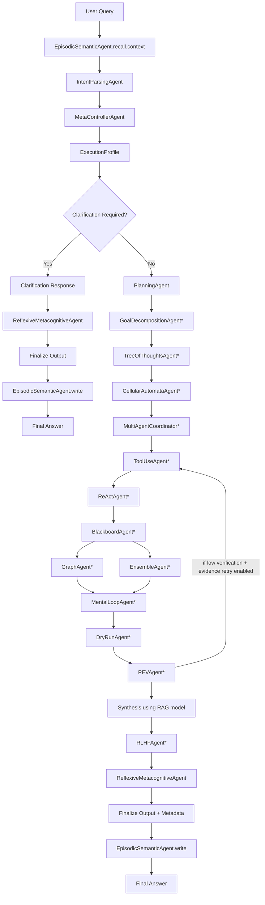

# Advanced AutoBot Architecture

This folder contains a single main implementation file: `architecture.py`.

It is an advanced, multi-agent, task-driven architecture that combines:

- Tool use
- ReAct loop
- Planning
- Multi-agent coordination
- PEV (Plan-Execute-Verify)
- Blackboard collaboration
- Episodic + semantic memory
- Tree of Thoughts
- Mental loop simulation
- Meta-controller routing
- Graph memory
- Ensemble reasoning
- Dry-run safety check
- RLHF-style self-revision
- Cellular automata prioritization
- Reflexive metacognitive confidence assessment

It uses the requested LiquidAI models by default:

- `LiquidAI/LFM2.5-1.2B-Instruct` (planning/revision)
- `LiquidAI/LFM2-1.2B-RAG` (final synthesis)
- `LiquidAI/LFM2.5-1.2B-Thinking` (reasoning/action decisions)

## Purpose

`architecture.py` is designed to be the central orchestrator for an advanced agentic AI workflow where:

- different specialist agents communicate through a shared context and message bus,
- planning and execution are separated,
- tool usage is integrated with iterative reasoning,
- safety and verification layers gate output quality,
- memory accumulates across runs,

# Advanced AutoBot Architecture

This folder contains the main orchestration implementation: `architecture.py`.

This implementation is an advanced, multi-agent, task-driven architecture combining a broad set of agentic patterns:

- Tool use and web retrieval
- The ReAct reasoning+action loop
- Planning and goal decomposition
- Multi-agent coordination with a shared blackboard
- PEV (Plan → Execute → Verify) verification loop
- Episodic + semantic memory
- Tree-of-Thoughts exploration
- Mental-loop simulation and dry-run safety checks
- Ensemble reasoning and RLHF-style local refinement
- Cellular-automata-based prioritization
- Reflexive metacognitive confidence assessment

Default models (configurable via environment variables):

- `PLANNING_MODEL` (default: `LiquidAI/LFM2.5-1.2B-Instruct`)
- `RAG_MODEL` (default: `LiquidAI/LFM2-1.2B-RAG`)
- `THINKING_MODEL` (default: `LiquidAI/LFM2.5-1.2B-Thinking`)

## Quick summary

`architecture.py` is a single-file, self-contained orchestrator that:

- Parses the user's intent into a probabilistic task taxonomy
- Builds an adaptive `execution_profile` (which stages to run)
- Optionally retrieves external evidence and runs iterative ReAct loops
- Performs verification (PEV), risk simulation, and final synthesis
- Persists episode summaries and semantic facts to `autobot_memory.json`

## Flowchart (Mermaid)

The following mermaid flow illustrates the canonical end-to-end path (the orchestrator adaptively enables or skips stages):



Stages marked with `*` are adaptively enabled or disabled by the computed `execution_profile`.

## How it works (step-by-step)

1. Recall: `EpisodicSemanticAgent` loads recent episodes (lexical token overlap) into context.
2. Intent parse: `IntentParsingAgent` requests a structured JSON intent analysis from the reasoning model; a semantic fallback runs if model parsing fails.
3. Meta-control: `MetaControllerAgent` converts intent probabilities into routing decisions (web usage, verification depth, ensemble, etc.).
4. Execution profile: the orchestrator scores complexity and selects which agents/stages to run.
5. Planning & decomposition: `PlanningAgent` produces a numbered plan; `GoalDecompositionAgent` and `TreeOfThoughtsAgent` expand or explore alternatives when required.
6. Evidence gathering: `ToolUseAgent` and `ReActAgent` gather web evidence and scrape pages; observations and sources populate the blackboard.
7. Verification: `PEVAgent`, `DryRunAgent`, and `MentalLoopAgent` simulate and verify coverage and risk.
8. Synthesis: a `rag`-style model synthesizes a grounded, evidence-aware final answer.
9. Refinement: optional RLHF-style critique+rewrite and reflexive confidence scoring.
10. Persistence: `EpisodicSemanticAgent.write` persists episodic and semantic facts and updates the graph memory.

## Usage examples

Run a simple query (from the `autobot` folder):

```bash
python architecture.py --query "Summarize recent advances in multi-agent planning and their trade-offs" --show-trace
```

Increase ReAct iterations for deeper exploration:

```bash
python architecture.py --query "Investigate best practices for building a PEV loop" --max-steps 6 --show-trace
```

### Example input

Query (CLI):

"Create a 3-step plan to extract data from a web page, validate it, and produce a short report. Include assumptions."

### Example output (truncated)

=== FINAL ANSWER ===

Plan:
1. Extract key fields from target pages.
2. Validate extracted fields with cross-checks.
3. Synthesize a short report listing assumptions and sources.

Draft answer: The agent collected evidence from 2 web pages and validated X data points. Assumptions: no JS-heavy content, pages accessible. Sources:
1. Example Site - https://example.com/page

---
Task category: data_gathering
Primary task: data_gathering
Secondary tasks: verification, analysis
Complexity: medium
Depth: medium
Intent tags: data_gathering, verification
Detected capabilities: Tool Use, Deep Web Research
Urgency: medium
Ambiguity score: 0.120
Requires clarification: False
Confidence: 0.63
PEV verified: True
Dry-run passed: True
Executed stages: 12
Skipped stages: 3

> Note: actual output includes full `execution_profile`, `intent_analysis`, and optional `AGENT COMMUNICATION TRACE` when `--show-trace` is passed.

## Input/Output expectations & tips

- Provide explicit objectives and constraints in your query for best routing.
- If the task depends on non-public data or local files, the agent currently cannot access local files unless you extend the code with connectors.
- Increase `--max-steps` for more exploration but expect longer runtimes and more API calls.

## Code review — key findings (quick)

- Good design: clear, modular agent classes, single `AgentContext` shared state, and robust orchestrator with replan logic.
- Fallbacks: the `HFModelPool._mock` and fallback inference ensure the system fails soft when model access is unavailable.

Suggested improvements and risks:

1. Model I/O validation: add JSON schema validation for all model outputs (`IntentParsingAgent`, `ReActAgent`, `TreeOfThoughtsAgent`) to avoid silent parsing errors.
2. Memory recall: current recall uses token overlap; moving to vector embeddings (FAISS or similar) will improve retrieval relevance.
3. Entity extraction: uses a simple regex; consider NER (spaCy or model-based) for higher-quality graph construction.
4. Concurrency safety: shared `ctx` is mutated from parallel threads (`_run_parallel_group`); ensure no race conditions when multiple threads modify `ctx.blackboard` or lists—consider thread locks or copy-on-write patterns for shared artifacts.
5. HF client usage: `InferenceClient.chat_completion` may differ across HF SDK versions—add adaptors and tests to validate response shape.
6. MemoryStore.save currently raises on write failure; consider a retry/backoff and not raising to avoid crashing the orchestrator in production.
7. Add structured unit and integration tests that mock model clients and tools to validate branching logic.

## Recommended next steps (minimal)

1. Add JSON schema checks for model outputs and fail gracefully with helpful debug messages.
2. Integrate an embedding-based recall (optional: FAISS + sentence-transformers) and add a feature flag.
3. Add a small test harness that runs `architecture.py` in mock mode (no HF token) with deterministic model mocks.

## Environment variables

- `HF_TOKEN` (required for real model calls)
- `PLANNING_MODEL`, `RAG_MODEL`, `THINKING_MODEL` (optional overrides)
- `AUTOBOT_USER_AGENT`, `REQUEST_TIMEOUT`, `AUTOBOT_MEMORY_FILE`

## Quick verification

Run:

```bash
python architecture.py --query "Explain your architecture and show latest AI agent trends" --show-trace
```

Expected checks:

- `execution_profile` printed
- `intent_analysis` printed
- `autobot_memory.json` updated with an episode after run

## Where to go from here

- Add unit tests for each Agent class and the orchestrator branches.
- Replace lexical recall with vector recall for better personalization.
- Add observability (structured logs, traces) and optionally export to LangSmith or other tracing platforms.

---

File: `autobot/architecture.py`

If you want, I can now:

- apply a small change to add JSON schema validation scaffolding, or
- scaffold a test harness that runs `architecture.py` in mock mode and asserts high-level outputs.

Which would you prefer next?

